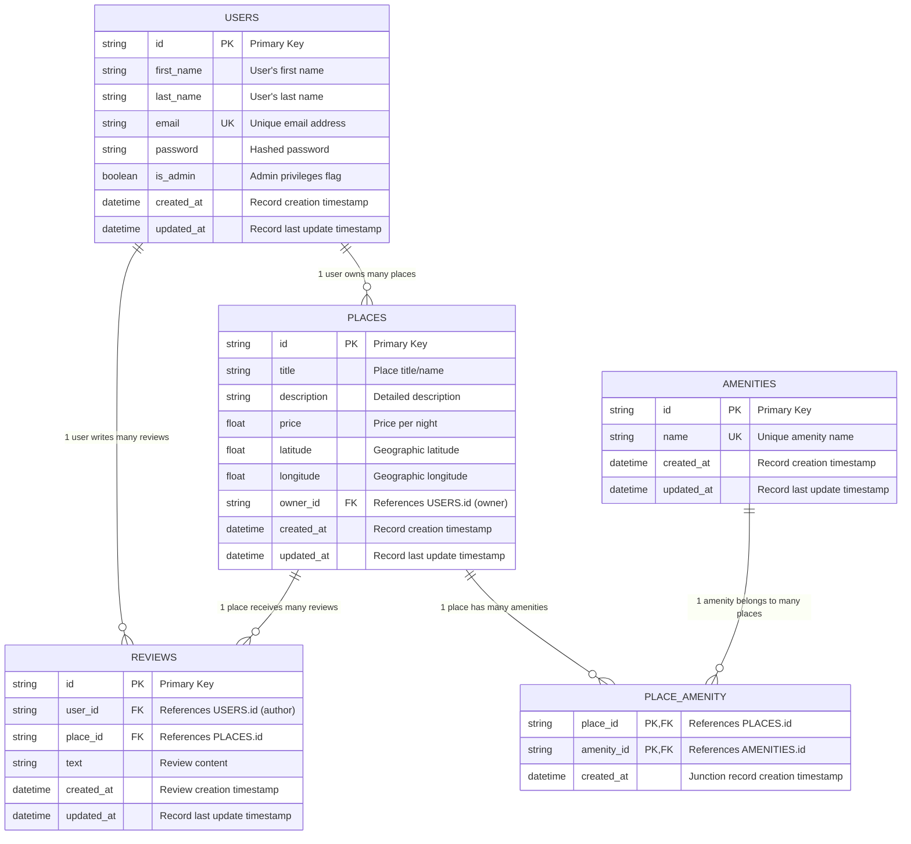

.# HBnB Project - Database Schema Documentation

## Holberton School HBnB | Part 3

---

## Table of Contents
1. [Project Overview](#project-overview)
2. [Database Schema](#database-schema)
3. [Entity Relationship Diagram (ERD)](#entity-relationship-diagram-erd)
4. [Entity Descriptions](#entity-descriptions)
5. [Relationships Analysis](#relationships-analysis)
6. [Data Integrity & Constraints](#data-integrity--constraints)
7. [Performance Considerations](#performance-considerations)

---

## Project Overview

The HBnB project is a platform similar to Airbnb that allows users to list properties (places) and leave reviews. This document presents the complete database schema design, including all entities, attributes, and relationships.

**Technologies Used:**
- Database Design: Mermaid.js ERD
- Documentation: Markdown
- Version Control: Git/GitHub

---

## Database Schema

### Entity Relationship Diagram (ERD)

---

## Entity Descriptions

### 2.1 USERS
The USERS table stores information about all platform users (guests and hosts).

| Attribute | Data Type | Constraints | Description |
|-----------|-----------|-------------|-------------|
| id | string | PRIMARY KEY | Unique identifier for each user |
| first_name | string | NOT NULL | User's first name |
| last_name | string | NOT NULL | User's last name |
| email | string | UNIQUE, NOT NULL | Unique email address for login |
| password | string | NOT NULL | Hashed password |
| is_admin | boolean | DEFAULT false | Admin privileges flag |
| created_at | datetime | NOT NULL | Creation timestamp |
| updated_at | datetime | NOT NULL | Last update timestamp |

---

### 2.2 PLACES
The PLACES table represents properties listed on the platform.

| Attribute | Data Type | Constraints | Description |
|-----------|-----------|-------------|-------------|
| id | string | PRIMARY KEY | Unique identifier |
| title | string | NOT NULL | Place title/name |
| description | text | - | Detailed property description |
| price | float | NOT NULL | Price per night |
| latitude | float | - | Geographic latitude |
| longitude | float | - | Geographic longitude |
| owner_id | string | FOREIGN KEY | References USERS.id (owner) |
| created_at | datetime | NOT NULL | Creation timestamp |
| updated_at | datetime | NOT NULL | Last update timestamp |

---

### 2.3 REVIEWS
The REVIEWS table stores user feedback about places.

| Attribute | Data Type | Constraints | Description |
|-----------|-----------|-------------|-------------|
| id | string | PRIMARY KEY | Unique identifier |
| user_id | string | FOREIGN KEY | References USERS.id (author) |
| place_id | string | FOREIGN KEY | References PLACES.id |
| text | text | NOT NULL | Review content |
| rate | int | NOT NULL | to rate form 1 to 5 |
| created_at | datetime | NOT NULL | Review creation timestamp |
| updated_at | datetime | NOT NULL | Last update timestamp |

---

### 2.4 AMENITIES
The AMENITIES table stores available amenities.

| Attribute | Data Type | Constraints | Description |
|-----------|-----------|-------------|-------------|
| id | string | PRIMARY KEY | Unique identifier |
| name | string | UNIQUE, NOT NULL | Amenity name (WiFi, Pool, etc.) |
| created_at | datetime | NOT NULL | Creation timestamp |
| updated_at | datetime | NOT NULL | Last update timestamp |

---

### 2.5 PLACE_AMENITY (Junction Table)
Junction table for many-to-many relationship between PLACES and AMENITIES.

| Attribute | Data Type | Constraints | Description |
|-----------|-----------|-------------|-------------|
| place_id | string | PRIMARY KEY, FOREIGN KEY | References PLACES.id |
| amenity_id | string | PRIMARY KEY, FOREIGN KEY | References AMENITIES.id |
| created_at | datetime | NOT NULL | Junction record timestamp |

**Composite Primary Key:** (place_id, amenity_id)

---

## Relationships Analysis

### One-to-Many Relationships

| Relationship | Type | Description |
|--------------|------|-------------|
| USERS → PLACES | One-to-Many | One user can own multiple properties |
| USERS → REVIEWS | One-to-Many | One user can write multiple reviews |
| PLACES → REVIEWS | One-to-Many | One place can receive multiple reviews |

### Many-to-Many Relationship

| Entity 1 | Entity 2 | Junction Table | Description |
|----------|----------|----------------|-------------|
| PLACES | AMENITIES | PLACE_AMENITY | Places can have multiple amenities, amenities can be in multiple places |

---

## Data Integrity & Constraints

| Constraint Type | Implementation |
|-----------------|----------------|
| **Primary Keys** | All tables use string-based UUIDs |
| **Foreign Keys** | `PLACES.owner_id → USERS.id` `REVIEWS.user_id → USERS.id` `REVIEWS.place_id → PLACES.id` `PLACE_AMENITY.place_id → PLACES.id` `PLACE_AMENITY.amenity_id → AMENITIES.id` |
| **Unique Constraints** | `USERS.email` `AMENITIES.name` |
| **Composite Key** | `PLACE_AMENITY(place_id, amenity_id)` |
| **NOT NULL** | All attributes except description, latitude, longitude |
| **Default Values** | `USERS.is_admin` defaults to `false` |

---

## Performance Considerations

### Recommended Indexes

| Table | Column(s) | Reason |
|-------|-----------|--------|
| USERS | email | Fast login authentication |
| PLACES | owner_id | Quick lookup of user's properties |
| PLACES | latitude, longitude | Geolocation searches |
| REVIEWS | place_id | Load all reviews for a place |
| REVIEWS | user_id | Load all reviews by a user |
| PLACE_AMENITY | place_id | Find amenities for a place |
| PLACE_AMENITY | amenity_id | Find places with specific amenities |

### Data Type Choices

- **String IDs**: UUID support for distributed systems
- **Float for price**: Accurate monetary values
- **Float for coordinates**: Precise geolocation
- **Int for rating**: to rate the place from 1 to 5
- **Datetime timestamps**: Time-based queries and sorting

---

### Authors 
- Raghad Almalki
- Jana Bakri
- Rama Alsheheri
  
